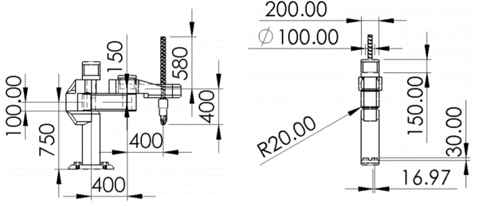

# Product Name
> Denavit-Hartenberg in Python

Main features of this repository are position, velocity, acceleration and torque calculation. Besides, a script is added with an animation of inverse kinematics solution.



## Installation

Clone the repo
   ```sh
   git clone https://github.com/OscarSantos98/SCARA.git
   ```

## Usage example

Run SCARA.py if you want to calculate symbolic and numeric expressions which provide motor torques and forces according to the type of Robot, in this case SCARA which is classified as RRP for Body-and-Arm notation and VRO for Joint Notation, thereby, 2 torques and 1 force.

Run animation.py if you are wondering how does the motion would look like.
*Note: inverse kinematics could have multiple solutions depending on the type of robot. In this code only one solution is used to calculate values to reach specified coordinates.*

## Development setup

Packages
- Numpy
- Sympy
- Matplotlib
- Tabulate

## Release History

* 0.0.1
    * Work in progress

## Meta

Oscar Santos – [@OscarSantosMu](https://twitter.com/OscarSantosMu)


## Contributing

1. Fork it (<https://github.com/OscarSantos98/SCARA/fork>)
2. Create your feature branch (`git checkout -b feature/fooBar`)
3. Commit your changes (`git commit -am 'Add some fooBar'`)
4. Push to the branch (`git push origin feature/fooBar`)
5. Create a new Pull Request
